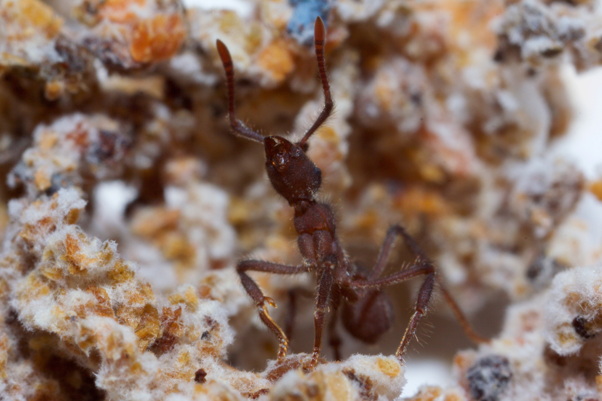

Hello! I am a postdoc in the [Khadempour Lab](https://www.khadlab.com/) at Rutgers University - Newark. I am generally interested in how mutualistic microbes facilitate the survival of insect hosts in the context of environmental stressors. I received my PhD in 2022 from the University of Wisconsin-Madison, where I worked in the [Currie lab](https://currielab.wisc.edu/) studying the microbes associated with fungus-growing ants.
{:style="float: right;margin-right: height="500px" width="333px"}
{:style="float: left;margin-left: height="500px" width="333px"}

&nbsp;
&nbsp;
