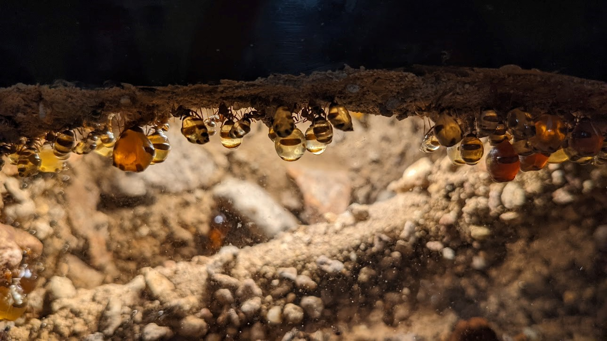

Hello! I am a postdoc/molecular biologist at the United States Department of Agriculture - Agricultural Research Service (USDA-ARS) in the Invasive Insect Biocontrol and Behavior Laboratory studying insect-specific viruses in the family Baculoviridae. These viruses can be applied as biological pesticides against insect pests. Previously, I was a NSF postdoctoral fellow in the [Khadempour Lab](https://www.khadlab.com/) at Rutgers University - Newark where I studied the microbiome of honeypot ants (pictured below). I received my PhD in 2022 from the University of Wisconsin-Madison, where I worked in the [Currie lab](https://currielab.wisc.edu/) studying the microbes associated with fungus-growing ants.
  
 Photo by Lily Khadempour   

Any opinions, findings, and conclusions or recommendations expressed in this material are those of the author(s) and do not necessarily reflect the views of the National Science Foundation.

